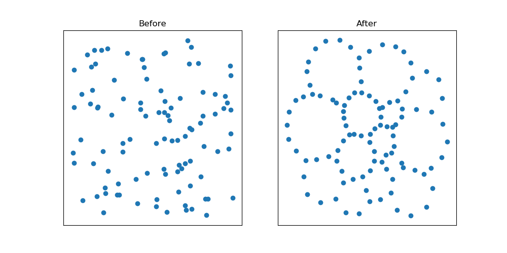
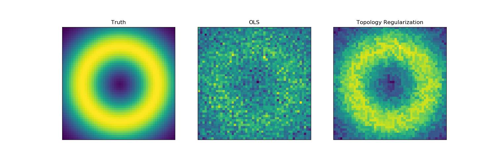

# TopologyLayer

Build Status: [](https://travis-ci.com/bruel-gabrielsson/TopologyLayer)

This repository contains a Python package that implements PyTorch-compatible persistent homology layers, as well as featurization of the output.

For an introduction to this topic, see the preprint **A Topology Layer for Machine Learning**, [arxiv:1905.12200](https://arxiv.org/abs/1905.12200)


### Point Cloud Optimization

In this example, we increase the size of holes in a random point cloud. [full source](examples/pointcloud/holes.py)

```python
from topologylayer.nn import AlphaLayer, BarcodePolyFeature
import torch, numpy as np, matplotlib.pyplot as plt

# random pointcloud
np.random.seed(0)
data = np.random.rand(100, 2)

# optimization to increase size of holes
layer = AlphaLayer(maxdim=1)
x = torch.autograd.Variable(torch.tensor(data).type(torch.float), requires_grad=True)
f1 = BarcodePolyFeature(1,2,0)
optimizer = torch.optim.Adam([x], lr=1e-2)
for i in range(100):
    optimizer.zero_grad()
    loss = -f1(layer(x))
    loss.backward()
    optimizer.step()
```




### Level Set Optimization

In this example, we use level set topology to regularize a least squares problem `y = X * beta + noise`.  [full source](examples/levelset/noisy_circle.py)

```python
import torch, torch.nn as nn, numpy as np, matplotlib.pyplot as plt
from topologylayer.nn import LevelSetLayer2D, SumBarcodeLengths, PartialSumBarcodeLengths
# see full source for setup of problem
# X, y, and beta_ols are created

class TopLoss(nn.Module):
    def __init__(self, size):
        super(TopLoss, self).__init__()
        self.pdfn = LevelSetLayer2D(size=size,  sublevel=False)
        self.topfn = PartialSumBarcodeLengths(dim=1, skip=1) # penalize more than 1 hole
        self.topfn2 = SumBarcodeLengths(dim=0) # penalize more than 1 max

    def forward(self, beta):
        dgminfo = self.pdfn(beta)
        return self.topfn(dgminfo) + self.topfn2(dgminfo)

tloss = TopLoss((50,50)) # topology penalty
dloss = nn.MSELoss() # data loss

beta_t = torch.autograd.Variable(torch.tensor(beta_ols).type(torch.float), requires_grad=True)
X_t = torch.tensor(X, dtype=torch.float, requires_grad=False)
y_t = torch.tensor(y, dtype=torch.float, requires_grad=False)
optimizer = torch.optim.Adam([beta_t], lr=1e-2)
for i in range(500):
    optimizer.zero_grad()
    loss = 0.1*tloss(beta_t) + dloss(y_t, torch.matmul(X_t, beta_t.view(-1)))
    loss.backward()
    optimizer.step()
```



# Get Started

Dependencies:
* Python (2 or 3)
* NumPy
* SciPy
* PyTorch 1.0+

## Installation using pip
Assuming you have the listed dependencies and pip, you should be able to install.

```bash
pip install git+https://github.com/bruel-gabrielsson/TopologyLayer.git
```

If you're having issues, see [troubleshooting notes](#troubleshooting-installation) below.  __MacOS__ users will likely need to see this section to set some necessary environment variables.

## (Optional) Conda Environment Configuration

First, create a conda environment
```bash
conda create -n toplayer # python=2 or python=3
source activate toplayer
```

Now, add dependencies
```bash
conda install numpy scipy matplotlib
conda install pytorch torchvision -c pytorch
```

Now, you can install the TopologyLayer package.
```bash
pip install git+https://github.com/bruel-gabrielsson/TopologyLayer.git
```


## (Optional) Compiling C++ Extensions

This section is primarily for those who wish to modify or contribute to the package.  We recommend you __do not__ install using `pip` as above, but do configure your environment to have the necessary dependencies.

If you haven't already, clone the repository
```bash
git clone git@github.com:bruel-gabrielsson/TopologyLayer.git
```

You are now ready to compile extensions.  PyTorch tutorial on extensions [here](https://pytorch.org/tutorials/advanced/cpp_extension.html)

*Important*: in environment, it seems like using the pytorch conda channel is important
```bash
source activate toplayer
conda install pytorch torchvision -c pytorch
```

Compilation uses python's `setuptools` module.

To complile (from TopologyLayer home directory):
```bash
source activate toplayer
python setup.py install --record files.txt
```
You should now have the package available in your environment.  You can run the above command any time you modify the source code, and the package on your path should update.

To delete all installed files (from TopologyLayer home directory):
```bash
xargs rm -rf < files.txt # files.txt from setup
rm -rf build dist topologylayer.egg-info
rm files.txt
```
This may be necessary if you need to refresh intermediate build files.


# High-Level Interface

For easiest use, high-level classes are provided for Pytorch compatibility.

The output of the diagram layers is not just a Pytorch tensor, but a tuple, which consists of
* A tuple (again) containing the persistence barcodes
* A flag indicating if the filtration was sub or super-levelset.

The recommended usage is to just pass the return type directly into a feature layer, which will take care of parsing.

## Barcode Return Types

The output of extensions will be a tuple of `torch.float` tensors (one tensor for each homology dimension), and a flag indicating whether computation was sub-level set persistence.

```python
dgms, issublevel = layer(x)
```

`dgms[k]` is the k-dimensional barcode, where `dgms[k][j][0]` is the birth time of bar `j` and `dgms[k][j][1]` is the death time of bar `j`.

All bars are returned (including bars of length 0).  It will be assumed that a featurization layer can choose to use or ignore these bars.

If you're unfamiliar with persistence, it is probably easiest to get started by just passing a barcode into a featurization layer.

## Persistence Layers

### LevelSetLayer

A `LevelSetLayer` takes in a function on a fixed space, and outputs a super-level set persistence diagram tensor.  There are two specialized variants: `LevelSetLayer1D` and `LevelSetLayer2D` which operate on 1D and 2D grids.  

`LevelSetLayer1D` only computes 0-dimensional persistence, since this is the only relevant barcode.
```python
import torch
from topologylayer.nn import LevelSetLayer1D, SumBarcodeLengths
# creates a superlevel set layer on a 10-point line.
layer = LevelSetLayer1D(size=10, sublevel=False)
feat = SumBarcodeLengths(dim=0)
y = torch.rand(10, dtype=torch.float).requires_grad_(True)
p = feat(layer(y))
```

`LevelSetLayer2D` can compute either 0-dim or both 0-dim and 1-dim barcodes.  The defualt behavior is to use the freudenthal triangulation of a grid on the specified size, which can be modified using the `complex` input argument.
```python
from topologylayer.nn import LevelSetLayer2D, SumBarcodeLengths
import torch

layer = LevelSetLayer2D(size=(3,3), maxdim=1, sublevel=False)
x = torch.tensor([[2, 1, 1],[1, 0.5, 1],[1, 1, 1]], dtype=torch.float)
dgms, issublevelset = layer(x)
```

The above should give two non-trivial bars (there will also be trivial bars listed)
`dgms[0] = tensor([[2., -inf]])` and `dgms[1] = tensor([[1.0000, 0.5000]])`
corresponding to the persistence diagrams.

A generic `LevelSetLayer` can be used with arbitrary `SimplicialComplex` objects, which is useful to extend beyond 1 and 2-dimensional images.  Note that the complex must currently be acyclic for the computation to be correct.  The following example is on a star graph:
```python
from topologylayer import SimplicialComplex
from topologylayer.nn import LevelSetLayer
import torch

cpx = SimplicialComplex()
cpx.append([0])
for i in range(1,5):
    cpx.append([i])
    cpx.append([0,i])

layer = LevelSetLayer(cpx, maxdim=0, sublevel=True)
y = torch.tensor([1,0,0,0,0], dtype=torch.float).requires_grad_(True)
dgms, issublevel = layer(y)
```
Note that the function `y` has one value for each vertex in the space.
`dgms[0]` should contain 3 bars of type `[0., 1.]`, one bar of type `[0., inf]` and one bar of type `[1., 1.]`.


### RipsLayer

A `RipsLayer` takes in a point cloud (an `n x d` tensor), and outputs the persistence diagram of the Rips complex.  The Rips layer assumes a fixed complex size `n`.

```python
import torch
from topologylayer.nn import RipsLayer
n, d = 10, 2
layer = RipsLayer(n, maxdim=1)
x = torch.rand(n, d, dtype=torch.float).requires_grad_(True)
dgms, issublevelset = layer(x)
```

### AlphaLayer
An `AlphaLayer` takes in a point cloud (an `n x d` tensor), and outputs the persistence diagram of the weak Alpha complex.

```python
import torch
from topologylayer.nn import AlphaLayer
n, d = 10, 2
layer = AlphaLayer(maxdim=1)
x = torch.rand(n, d, dtype=torch.float).requires_grad_(True)
dgms, issublevelset = layer(x)
```

The `AlphaLayer` is similar to the Rips layer, but potentially much faster for low-dimensional computations.

Note that a weak Alpha complex is not an Alpha complex.  It is better thought of as the restriction of the Rips complex to the Delaunay Triangulation of the space.

### Rips and Alpha Layers in 1 Dimension

These Layers can be used in 1 dimension.  However, make sure the input has shape `n x 1` and that `maxdim=0`.  Note that in this case, there is really no reason to use `RipsLayer` over `AlphaLayer`, since the diagrams should be identical.

`RipsLayer` example
```python
import torch
from topologylayer.nn import RipsLayer
n, d = 10, 1
layer = RipsLayer(n, maxdim=0)
x = torch.rand(n, d, dtype=torch.float).requires_grad_(True)
dgms, issublevelset = layer(x)
```

`AlphaLayer` example
```python
import torch
from topologylayer.nn import AlphaLayer
n, d = 10, 1
layer = AlphaLayer(maxdim=0)
x = torch.rand(n, d, dtype=torch.float).requires_grad_(True)
dgms, issublevelset = layer(x)
```

### Persistence Backends

There are several available algorithms for computing persistence, which can be chosen by setting the `alg` keyword in any layer.
* `'hom'` (default) will run the standard reduction algorithm
* `'hom2'` will run the homology reduction algorithm, but will attempt to minimize nonzeros in a heuristic way
* `'cohom'` will run the cohomology algorithm

```python
layer = LevelSetLayer1D(size=10, sublevel=False, alg='cohom')
```

Different algorithms may give better performance depending on the application, although `'hom'` currently performs fastest on some [simple benchmarks](examples/cpp/alg_comparison.py).

## Featurization Layers
Persistence diagrams are hard to work with directly in machine learning.  We implement some easy to work with featurizations.

### SumBarcodeLengths

A `SumBarcodeLengths` layer takes the output of a diagram layer, and sums up the lengths of the persistence pairs in a given dimension, ignoring infinite bars.

```python
import torch
from topologylayer.nn import LevelSetLayer2D, SumBarcodeLengths

layer = LevelSetLayer2D((28,28), maxdim=1)
sumlayer = SumBarcodeLengths(dim=1)

x = torch.rand(28,28, dtype=torch.float).requires_grad_(True)
dgminfo = layer(x)
dlen = sumlayer(dgminfo)
```

### TopKBarcodeLengths

A `TopKBarcodeLengths` layer takes in the output of a diagram layer, and returns the top `k` barcode lengths in a given homology dimension as a tensor, padding by 0 if necessary.  Parameters are `dim` and `k`
```python
import torch
from topologylayer.nn import TopKBarcodeLengths, LevelSetLayer2D
layer = LevelSetLayer2D(size=(10,10), sublevel=False)
feat = TopKBarcodeLengths(dim=1, k=2)
y = torch.rand(10,10, dtype=torch.float).requires_grad_(True)
p = feat(layer(y))
```
the output should be a tensor of length 2.


### BarcodePolyFeature

A `BarcodePolyFeature` layer takes in the output of a diagram layer, and returns a polynomial feature as in Adcock, Carlsson, and Carlsson.  Parameters are homology dimension `dim`, and exponents `p` and `q`.  By defalut, all zero-length bars will be ignored.
```python
import torch
from topologylayer.nn import BarcodePolyFeature, LevelSetLayer2D
layer = LevelSetLayer2D(size=(10,10), sublevel=False)
feat = BarcodePolyFeature(dim=0, p=1, q=1)
y = torch.rand(10,10, dtype=torch.float).requires_grad_(True)
p = feat(layer(y))
```

### PartialSumBarcodeLengths
A `PartialSumBarcodeLengths` layer takes in the output of a diagram layer, and returns the sum of the barcode lengths in dimension `dim` skipping the first `skip` finite bars.
```python
import torch
from topologylayer.nn import PartialSumBarcodeLengths, LevelSetLayer2D
layer = LevelSetLayer2D(size=(10,10), sublevel=False)
feat = PartialSumBarcodeLengths(dim=1, skip=2)
y = torch.rand(10,10, dtype=torch.float).requires_grad_(True)
p = feat(layer(y))
```

# Simplicial Complexes

If you wish to create new high-level layers for your own purposes, it is useful to know the basics of constructing a simplicial complex.  The type made available is named `SimplicialComplex`

### Construction

Complex construction can be done in python by initializing an empty `SimplicialComplex` and using the `append` method to add simplices as lists of integers.

```python
from topologylayer import SimplicialComplex
X = SimplicialComplex()
# 0-simplices
X.append([0])
X.append([1])
X.append([2])
# 1-simplices
X.append([0,1])
X.append([1,2])
X.append([0,2])
# 2-simplices
X.append([0,1,2])
```
__Warning:__ there are currently no checks to make sure a `SimplicialComplex` does not contain duplicate simplices, or that all faces are included.  Thus, one should be very careful to add all faces and do so exactly once.

__Warning:__ 0-simplices (vertices) are assumed to start with `[0]` and end at `[n]` where `n` is the total number of vertices.  You may run into issues if you use a different set of labels.

__Warning:__ the persistence computation currently assumes that the complex is acyclic at the end of the filtration in order to precompute the number of barcode pairs.

# Note on GPU use

You can use `topologylayer` with tensors that are on GPUs. However, because the persistent homology calculation takes place on CPU, there will be some overhead from memory movement.


# (Deprecated) Dionysus Drivers

There are deprecated functions that call Dionysus (https://mrzv.org/software/dionysus2/) for the persistence calculations.
There functions are superseded by the PyTorch Extensions, but may still be used.  Note that initialization may differ slightly from the default layers.

```bash
source activate toplayer
pip install --verbose dionysus
```

The corresponding imports are
```python
from topologylayer.nn.levelset_dionysus import LevelSetLayer1D
from topologylayer.nn.levelset_dionysus import LevelSetLayer as LevelSetLayer2D
from topologylayer.nn.alpha_dionysus import AlphaLayer
from topologylayer.nn.rips_dionysus import RipsLayer
```
The return types should be the same as the extensions, but output may not be identical (zero-length bars are truncated).

# Troubleshooting Installation

This package has been successfully installed/tested on the following systems:
* Fedora 29
* Ubuntu, running on Windows Linux Subsystem
* MacOS High Sierra

Installation has been successful using [Anaconda Python](https://www.anaconda.com/distribution/).  See [installation notes above](#optional-conda-environment-configuration)

__General Information:__
Pass a `--verbose` flag to `pip` if you are having any issues.
```bash
pip install --verbose git+https://github.com/bruel-gabrielsson/TopologyLayer.git
```
If your issue appears to be due to the package, please create an [an issue](https://github.com/bruel-gabrielsson/TopologyLayer/issues) with the following information:
* Your operating system
* Python version, environment setup
* The verbose output of the installation command
* Any other relevant information

__MacOS Information:__
If PyTorch was compiled using `clang++`, you may run into issues if `pip` defaults to `g++`.  You can make `pip` use `clang++` by setting the `CXX` environment variable.  The `CPPFLAGS` environment variable also needs to be set to look at `libc++` to avoid compatibility issues with the PyTorch headers.  The `MACOSX_DEPLOYMENT_TARGET` environment variable may also need to be set (set the target to be whatever your OS version is).
```bash
export CXX=/usr/bin/clang++
export CPPFLAGS="-stdlib=libc++"
export MACOSX_DEPLOYMENT_TARGET=$(sw_vers -productVersion)
pip install --verbose git+https://github.com/bruel-gabrielsson/TopologyLayer.git
```
